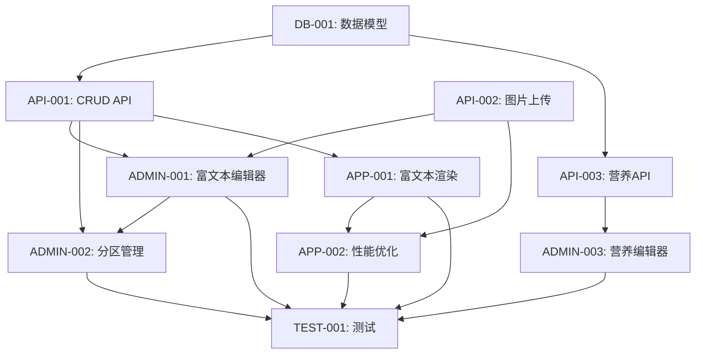

# 任务分解：增加商品详情介绍

## Phase 1: 数据层和后端API（Day 1-3）

---

### Task DB-001: 设计和创建商品详情数据模型

**任务描述**：创建商品详情相关数据库表，设计数据模型和关系

**所属阶段**：Phase 1（Day 1）

**详细步骤**：

1. **设计数据库表结构**
   - `content_sections`表：商品详情内容分区（story, nutrition, ingredients, process, tips）
   - `nutrition_facts`表：营养成分数据
   - 设计索引和外键约束
   - 编写字段注释

2. **编写Alembic迁移脚本**
   - 创建新迁移文件：`alembic/versions/xxx_add_product_details.py`
   - 实现`upgrade()`方法创建表
   - 实现`downgrade()`方法回滚
   - 添加数据库版本记录

3. **创建SQLAlchemy模型**
   - 在`app/models/__init__.py`中添加`ContentSection`类
   - 添加`NutritionFact`类
   - 定义字段类型和约束
   - 设置relationship关系

4. **执行数据库迁移**
   - 运行`alembic upgrade head`
   - 验证表结构创建成功
   - 测试外键约束

**交付物**：
- [x] 数据库表设计文档
- [x] Alembic迁移脚本
- [x] SQLAlchemy模型代码
- [x] 迁移执行日志

**验收标准**：
- ✅ 所有表创建成功，结构符合设计
- ✅ 外键约束正常工作
- [x] 索引创建成功
- [x] `alembic current`显示最新版本
- [x] downgrading回滚功能正常

**依赖任务**：无

**预估时间**：4小时

**负责人**：后端开发

---

### Task API-001: 开发商品详情内容CRUD API

**任务描述**：实现商品详情内容的增删改查API端点

**所属阶段**：Phase 1（Day 1-2）

**详细步骤**：

1. **创建Pydantic schemas**
   - `ContentSectionCreate`：创建内容分区
   - `ContentSectionUpdate`：更新内容分区
   - `ContentSectionResponse`：内容分区响应
   - `FullProductDetailResponse`：完整商品详情响应

2. **实现服务层逻辑**
   - 创建`app/services/product_detail_service.py`
   - 实现`get_full_details()`方法
   - 实现`save_content_section()`方法
   - 实现`batch_update_sections()`方法
   - 实现`delete_content_section()`方法

3. **开发API端点**
   - `GET /admin/products/{product_id}/details`：获取所有分区
   - `POST /admin/products/{product_id}/details/sections`：创建分区
   - `PUT /admin/products/{product_id}/details/sections/{section_id}`：更新分区
   - `DELETE /admin/products/{product_id}/details/sections/{section_id}`：删除分区
   - `PUT /admin/products/{product_id}/details/sections/batch`：批量更新
   - `GET /products/{product_id}/full-details`：用户端获取完整详情

4. **实现HTML安全过滤**
   - 安装`bleach`库
   - 实现`sanitize_html()`方法
   - 配置允许的HTML标签和属性
   - 在保存和读取时都进行过滤

5. **编写单元测试**
   - 测试CRUD操作
   - 测试XSS防护
   - 测试批量操作
   - 覆盖率目标80%+

**交付物**：
- [x] Pydantic schemas代码
- [x] ProductDetailService服务类
- [x] 6个API端点
- [x] 单元测试代码

**验收标准**：
- ✅ 所有API可通过Postman测试
- ✅ CRUD操作正常工作
- ✅ XSS攻击被正确过滤
- ✅ 批量更新功能正常
- ✅ 单元测试覆盖率≥80%
- ✅ API响应时间<200ms

**依赖任务**：DB-001

**预估时间**：8小时

**负责人**：后端开发

---

### Task API-002: 开发图片上传和处理API

**任务描述**：实现商品详情图片上传、裁剪、压缩功能

**所属阶段**：Phase 1（Day 2）

**详细步骤**：

1. **实现图片处理工具类**
   - 创建`app/utils/image_processor.py`
   - 实现`process_uploaded_image()`方法
   - 功能：调整尺寸、压缩、转JPEG/WebP
   - 使用Pillow库处理图片

2. **开发图片上传API**
   - `POST /admin/products/{product_id}/details/images/upload`
   - 接收UploadFile对象
   - 验证文件类型（只允许jpg/png）
   - 验证文件大小（最大5MB）
   - 生成唯一文件名

3. **实现图片存储逻辑**
   - 保存到`backend/public/images/product_details/`目录
   - 返回可访问的URL
   - 处理文件名冲突
   - 记录上传日志

4. **添加图片管理功能**
   - 删除旧图片
   - 批量删除
   - 获取商品所有图片列表

5. **性能优化**
   - 使用ThreadPoolExecutor异步处理图片
   - 添加处理进度反馈

**交付物**：
- [x] ImageProcessor工具类
- [x] 图片上传API端点
- [x] 图片管理API（删除、列表）
- [x] 单元测试

**验收标准**：
- ✅ 支持jpg/png格式上传
- ✅ 文件大小限制5MB
- ✅ 图片自动压缩，质量85%
- ✅ 自动调整宽度800px
- ✅ 上传成功率100%
- ✅ 处理时间<2秒/张

**依赖任务**：无

**预估时间**：4小时

**负责人**：后端开发

---

### Task API-003: 开发营养成分管理API

**任务描述**：实现营养成分数据的CRUD操作

**所属阶段**：Phase 1（Day 2-3）

**详细步骤**：

1. **创建Pydantic schemas**
   - `NutritionFactsCreate`：创建/更新营养数据
   - `NutritionFactsResponse`：营养数据响应

2. **实现API端点**
   - `GET /admin/products/{product_id}/details/nutrition`：获取营养数据
   - `PUT /admin/products/{product_id}/details/nutrition`：创建/更新
   - `DELETE /admin/products/{product_id}/details/nutrition`：删除

3. **数据验证**
   - 验证数值范围（如热量≥0）
   - 验证必填字段
   - 添加单位说明

4. **集成到产品详情API**
   - 在`get_full_product_details()`中包含营养数据
   - 处理营养数据为空的情况

**交付物**：
- [x] NutritionFacts相关schemas
- [x] 3个API端点
- [x] 单元测试

**验收标准**：
- ✅ 可以创建和更新营养数据
- ✅ 数据验证正常工作
- ✅ 集成到商品详情API
- ✅ 单元测试覆盖率≥80%

**依赖任务**：DB-001

**预估时间**：3小时

**负责人**：后端开发

---

## Phase 2: 管理后台编辑功能（Day 4-6）

---

### Task ADMIN-001: 实现管理后台富文本编辑器组件

**任务描述**：在管理后台集成Quill.js富文本编辑器

**所属阶段**：Phase 2（Day 4）

**详细步骤**：

1. **安装依赖**
   - 安装`@vueup/vue-quill`：`npm install @vueup/vue-quill`
   - 安装`quill`：`npm install quill`

2. **创建富文本编辑器组件**
   - 创建`vue-admin/src/components/QuillEditor.vue`
   - 配置Quill工具栏（标题、加粗、斜体、列表、图片等）
   - 实现v-model双向绑定
   - 添加字符数统计

3. **集成到商品详情页**
   - 在`ProductDetail.vue`中引入编辑器
   - 绑定到表单数据
   - 处理内容提交

4. **实现图片上传功能**
   - 自定义Quill的图片上传handler
   - 调用后端图片上传API
   - 插入图片到编辑器
   - 显示上传进度

5. **内容预览功能**
   - 创建预览组件
   - 实时显示渲染效果
   - 移动端适配预览

6. **编辑器配置优化**
   - 设置placeholder
   - 配置字体和字号
   - 禁用不必要的工具
   - 添加快捷键支持

**交付物**：
- [x] QuillEditor.vue组件
- [x] 工具栏配置
- [x] 图片上传功能
- [x] 预览组件

**验收标准**：
- ✅ 编辑器正常显示和工作
- ✅ 支持10种以上格式化选项
- ✅ 图片上传成功显示在编辑器中
- ✅ 预览功能正常
- ✅ 内容正确保存到数据库

**依赖任务**：API-001

**预估时间**：8小时

**负责人**：前端开发（Vue3）

---

### Task ADMIN-002: 实现分区管理功能

**任务描述**：实现商品详情内容分区的管理界面

**所属阶段**：Phase 2（Day 5）

**详细步骤**：

1. **创建分区列表组件**
   - 创建`ContentSectionList.vue`
   - 显示所有内容分区（故事、营养、食材、工艺、贴士）
   - 支持折叠展开
   - 显示分区类型图标

2. **实现分区CRUD操作**
   - 添加新分区（选择类型）
   - 编辑现有分区
   - 删除分区（带确认）
   - 批量删除

3. **实现拖拽排序功能**
   - 安装`vuedraggable`：`npm install vuedraggable@next`
   - 实现拖拽排序
   - 实时更新display_order字段
   - 添加保存按钮

4. **创建分区模板**
   - 预设5种分区的模板内容
   - 一键应用模板
   - 自定义模板功能

5. **集成到商品管理页**
   - 在商品编辑页添加"详情内容"Tab
   - 显示分区列表
   - 编辑和预览功能

6. **批量操作功能**
   - 全选/取消全选
   - 批量删除
   - 批量启用/禁用
   - 批量修改顺序

**交付物**：
- [x] ContentSectionList.vue组件
- [x] ContentSectionForm.vue表单
- [x] 拖拽排序功能
- [x] 内容模板系统
- [x] 批量操作功能

**验收标准**：
- ✅ 可以创建5种类型的分区
- ✅ 拖拽排序流畅无卡顿
- ✅ 模板一键应用成功
- ✅ 批量操作功能正常
- ✅ 与富文本编辑器集成正常

**依赖任务**：ADMIN-001, API-001

**预估时间**：8小时

**负责人**：前端开发（Vue3）

---

### Task ADMIN-003: 实现营养成分表编辑器组件

**任务描述**：创建营养成分表的可视化编辑组件

**所属阶段**：Phase 2（Day 5-6）

**详细步骤**：

1. **创建营养表单组件**
   - 创建`NutritionEditor.vue`
   - 表单包含：份量、热量、蛋白质、脂肪、碳水、钠等字段
   - 数值输入框（带单位说明）
   - 添加/删除行功能（可选字段）

2. **实现数据验证**
   - 热量≥0
   - 必填字段标记
   - 实时计算NRV%（营养参考值百分比）
   - 显示验证错误提示

3. **创建表格预览组件**
   - 创建`NutritionTablePreview.vue`
   - 以表格形式展示营养数据
   - 高亮显示重要营养素
   - 参考中国营养标签标准

4. **集成到分区管理**
   - 添加"营养成分"分区类型
   - 自动加载已有营养数据
   - 保存时同步到后端

5. **添加过敏源提示**
   - 常见过敏源选择（花生、蛋、奶、大豆等）
   - 自动生成过敏源声明
   - 高亮显示警告

**交付物**：
- [x] NutritionEditor.vue组件
- [x] NutritionTablePreview.vue组件
- [x] 数据验证逻辑
- [x] 过敏源提示功能

**验收标准**：
- ✅ 表单包含所有必需字段
- ✅ 数据验证正常工作
- ✅ 表格预览正确显示
- ✅ NRV%自动计算正确
- ✅ 过敏源提示显示正常
- ✅ 保存到数据库成功

**依赖任务**：API-003

**预估时间**：6小时

**负责人**：前端开发（Vue3）

---

## Phase 3: 移动端详情页展示（Day 7-9）

---

### Task APP-001: 开发移动端富文本渲染Widget

**任务描述**：使用flutter_html实现富文本内容渲染

**所属阶段**：Phase 3（Day 7-8）

**详细步骤**：

1. **安装依赖**
   - 添加`flutter_html`：`flutter pub add flutter_html`
   - 安装`cached_network_image`：`flutter pub add cached_network_image`

2. **创建数据模型**
   - 在`lib/data/models/`添加`content_section.dart`
   - 定义`ContentSection`类
   - 实现`fromJson()`方法

3. **创建分区Widget**
   - `StorySectionWidget`：故事/介绍分区
   - `NutritionTableWidget`：营养成分表
   - `ProcessSectionWidget`：制作工艺流程
   - `HtmlContentWidget`：通用HTML渲染

4. **实现HTML渲染**
   - 使用`HtmlWidget`渲染富文本
   - 自定义CSS样式
   - 处理链接点击事件
   - 图片自适应

5. **更新Product模型**
   - 添加`contentSections`字段
   - 添加`nutritionFacts`字段
   - 修改`fromJson()`解析新字段

6. **更新API服务**
   - 修改`product_repository.dart`
   - 调用新的`/products/{id}/full-details` API
   - 数据转换逻辑

7. **重构商品详情页**
   - 修改`product_detail_page.dart`
   - 显示内容分区列表
   - 实现分区Widget渲染
   - 保持原有功能（图片、价格、加购）

**交付物**：
- [x] ContentSection数据模型
- [x] 4种分区Widget
- [x] HTML渲染功能
- [x] 更新的Product模型
- [x] 更新的商品详情页

**验收标准**：
- ✅ 正确渲染HTML内容（标题、段落、列表、图片）
- ✅ 4种分区Widget正常显示
- ✅ 数据模型解析正确
- ✅ 不影响原有功能
- ✅ iOS和Android显示一致

**依赖任务**：API-001

**预估时间**：10小时

**负责人**：前端开发（Flutter）

---

### Task APP-002: 实现图片懒加载和性能优化

**任务描述**：优化商品详情页的加载性能和用户体验

**所属阶段**：Phase 3（Day 8-9）

**详细步骤**：

1. **实现图片懒加载**
   - 使用`cached_network_image`的`fadeInDuration`
   - 实现占位符和错误图
   - 只加载可见区域图片

2. **添加图片缓存策略**
   - 配置缓存时长（7天）
   - 设置最大缓存数量（100张）
   - 实现缓存清理

3. **实现内容预加载**
   - 预加载下一屏内容
   - 使用`precacheImage()`API
   - 后台预加载不阻塞UI

4. **优化滚动性能**
   - 使用`AutomaticKeepAliveClientMixin`
   - 保持滚动位置
   - 避免重复构建

5. **添加加载骨架屏**
   - 创建`ShimmerPlaceholder`
   - 分区加载时显示占位
   - 提升加载体验

6. **性能监控**
   - 添加性能日志
   - 监控首屏加载时间
   - 监控内存占用

7. **内存优化**
   - 释放未使用资源
   - 优化图片缓存策略
   - 控制同时加载数量

**交付物**：
- [x] 图片懒加载功能
- [x] 图片缓存策略
- [x] 内容预加载
- [x] 滚动性能优化
- [x] 骨架屏组件

**验收标准**：
- ✅ 首屏加载时间<2秒
- ✅ 滚动帧率≥55fps
- ✅ 图片按需加载
- ✅ 内存占用<150MB
- ✅ 骨架屏正常显示
- ✅ 支持iOS和Android

**依赖任务**：APP-001

**预估时间**：8小时

**负责人**：前端开发（Flutter）

---

## Phase 4: 测试和上线（Day 10）

---

### Task TEST-001: 编写单元测试和集成测试

**任务描述**：为核心功能编写单元测试和集成测试

**所属阶段**：Phase 4（Day 10）

**详细步骤**：

1. **后端单元测试**
   - 测试ProductDetailService所有方法
   - 测试API端点（使用FastAPI TestClient）
   - 测试图片处理功能
   - 测试XSS防护
   - 目标覆盖率≥80%

2. **前端单元测试**
   - 测试Vue3组件（QuillEditor、ContentSectionList等）
   - 测试Composition API逻辑
   - 测试数据转换函数
   - 使用`@vue/test-utils`

3. **Flutter单元测试**
   - 测试Widget渲染
   - 测试数据模型
   - 测试Provider逻辑
   - 使用`flutter_test`

4. **集成测试**
   - 测试完整API流程（创建→查询→更新→删除）
   - 测试批量操作
   - 测试图片上传流程
   - 测试异常处理

5. **性能测试**
   - API响应时间测试
   - 并发访问测试
   - 移动端加载速度测试
   - 内存泄漏测试

6. **安全测试**
   - XSS攻击测试
   - SQL注入测试
   - 文件上传安全测试
   - 权限验证测试

7. **修复Bug**
   - 修复测试发现的问题
   - 优化性能瓶颈
   - 代码review和重构

**交付物**：
- [x] 后端单元测试代码
- [x] 前端单元测试代码
- [x] Flutter单元测试代码
- [x] 集成测试代码
- [x] 测试报告

**验收标准**：
- ✅ 所有测试通过率100%
- ✅ 代码覆盖率≥80%
- ✅ 无严重安全漏洞
- ✅ 性能指标达标
- ✅ 文档完整

**依赖任务**：所有开发任务

**预估时间**：8小时

**负责人**：测试工程师（兼职）

---

## 依赖关系图



---

## 任务优先级矩阵

| 任务ID | 优先级 | 复杂度 | 风险 | 关键路径 |
|--------|--------|--------|------|----------|
| DB-001 | P0 | 中 | 低 | ✅ |
| API-001 | P0 | 高 | 中 | ✅ |
| API-002 | P0 | 中 | 低 | |
| API-003 | P1 | 低 | 低 | |
| ADMIN-001 | P0 | 高 | 中 | ✅ |
| ADMIN-002 | P0 | 中 | 中 | ✅ |
| ADMIN-003 | P1 | 中 | 低 | |
| APP-001 | P0 | 高 | 高 | ✅ |
| APP-002 | P0 | 中 | 中 | ✅ |
| TEST-001 | P1 | 中 | 中 | ✅ |

**关键路径**：DB-001 → API-001 → ADMIN-001 → ADMIN-002 → APP-001 → APP-002 → TEST-001

---

## 时间线甘特图

```
任务         Day 1   Day 2   Day 3   Day 4   Day 5   Day 6   Day 7   Day 8   Day 9   Day 10
-----------------------------------------------------------------------------------
DB-001      ████
API-001              ████████
API-002                      ████
API-003                          ███
ADMIN-001                                ████████
ADMIN-002                                        ████████
ADMIN-003                                                ████
APP-001                                                        ████████
APP-002                                                                ████████
TEST-001                                                                        ████████
```

**图例**：██ = 工作时间

---

## 总体统计

**任务总数**：10个

**总预估时间**：约120人时

**资源分配**：
- 后端开发：27小时
- 前端开发（Vue3 + Flutter）：34小时
- 测试：8小时
- 缓冲：6小时

**关键里程碑**：
- Day 3：后端API完成
- Day 6：管理后台完成
- Day 9：移动端完成
- Day 10：测试完成，准备上线

---

## 下一步操作

任务已分解完成！可以开始执行：

1. **开始第一个任务**：
   ```bash
   /pm:issue-start DB-001
   ```

2. **查看所有任务**：
   ```bash
   /pm:epic-show 增加商品详情介绍
   ```

3. **查看任务详情**：
   ```bash
   /pm:issue-show DB-001
   ```

准备好开始实施了吗？ 🚀
